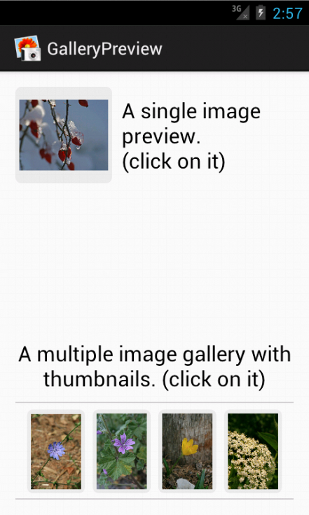
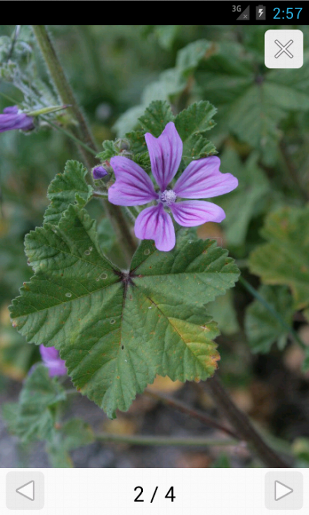

GalleryPreview for Android
==============

A Gallery Preview popup for Android that support:
- Single image preview.
- Multiple (gallery) image preview.

Creation of a multiple image preview:
---------
```java
ArrayList<Drawable> images = new ArrayList<Drawable>();
/* Fill images */
new GalleryPreview(getActivity(), images).show();
```

Creation of a multiple image preview with a custom start image:
---------
```java
ArrayList<Drawable> images = new ArrayList<Drawable>();
/* Fill images */
GalleryPreview gallery = new GalleryPreview(getActivity(), images);
gallery.showWithImageIndex(3);
```
Some screens
---------





How To Get Started
==================
This Python implementation need to run on [codeskulptor.org](http://www.codeskulptor.org). 
- Copy the code from **py-RiceRocks.py**
- Paste the code inside [codeskulptor.org](http://www.codeskulptor.org)
- Press the play button.
- Enjoy :)

License 
---------
GalleryPreview is available under the MIT license. See the LICENSE file for more info.

**Follow me on twitter [@capezzbr](http://www.twitter.com/capezzbr)**
